# About

`geos` is a CLI tool that provides some geometric commands that I personally find useful. For example, I frequently find myself wanting to do various operations on S2 cells without opening a debugger.

GeoS stands for **Geo Stuff** formally and **Geo Shit** colloquially.

# Installation

Build it yourself; `geos` is not currently available from any package management artifactories. 

```bash
> cargo build -r
> alias geos='$(pwd)/target/release/geos'
```

# Usage

Many commands use [WKT format](https://en.wikipedia.org/wiki/Well-known_text_representation_of_geometry) for input and output geometries.

## `s2` commands

These commands work with [S2 cells](https://s2geometry.io/).

### `cover`

The most basic example is computing the S2 cell that contains a point.
```bash
> geos s2 cover -l 14 -s quad -- "POINT(-122.38894169588661 37.76935778889086)"
4/00101323333202
```
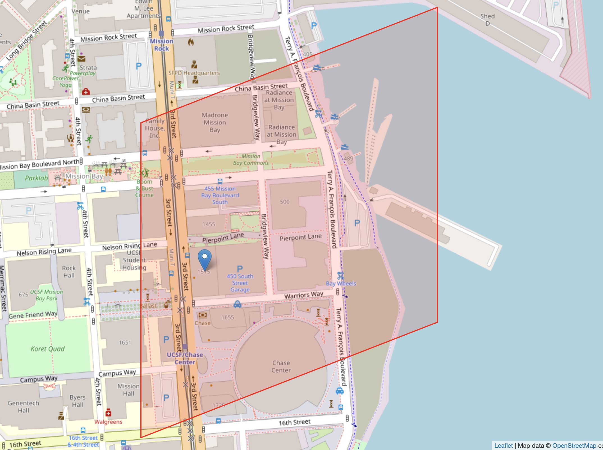

<br><br>
Other geometries can also be covered:
```bash
> geos s2 cover -l 20 -- "POLYGON ((-122.389181 37.769693, -122.388672 37.769718, -122.388602 37.768972, -122.389112 37.768942, -122.389181 37.769693))"
```

Original Geometry | Covered Geometry
:----------------:|:----------------:
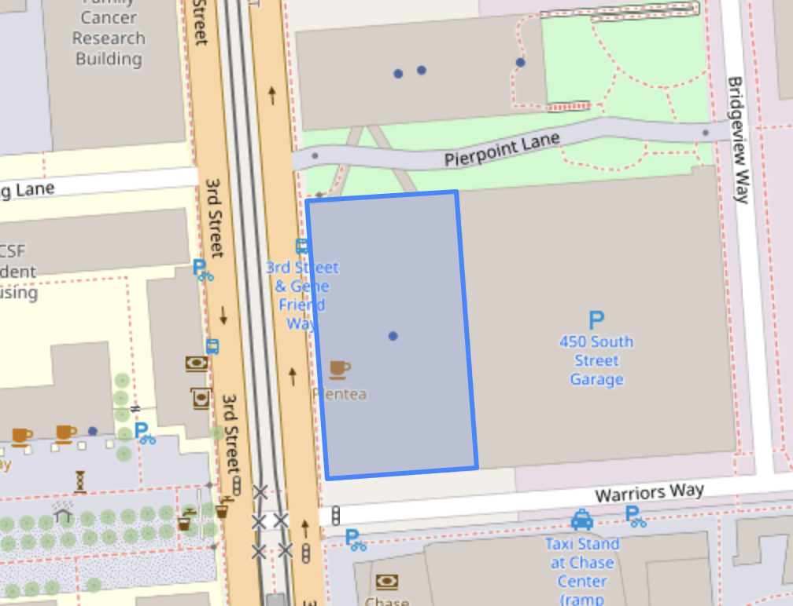 | 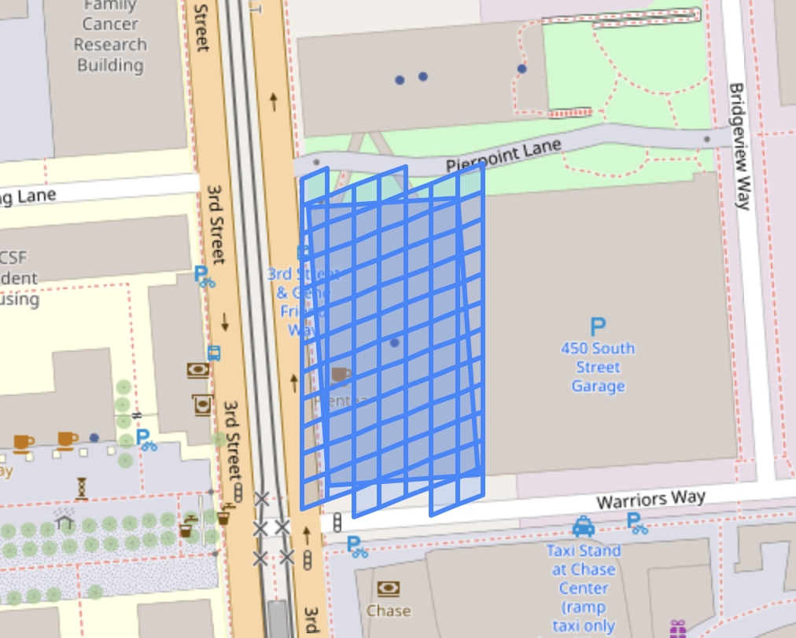


### `cut`

A geometry can be cut by an S2 grid at a given level. 
```bash
> geos s2 cut -l 18 -f oneline -- "POLYGON ((-122.389181 37.769693, -122.388672 37.769718, -122.388602 37.768972, -122.389112 37.768942, -122.389181 37.769693))"
```
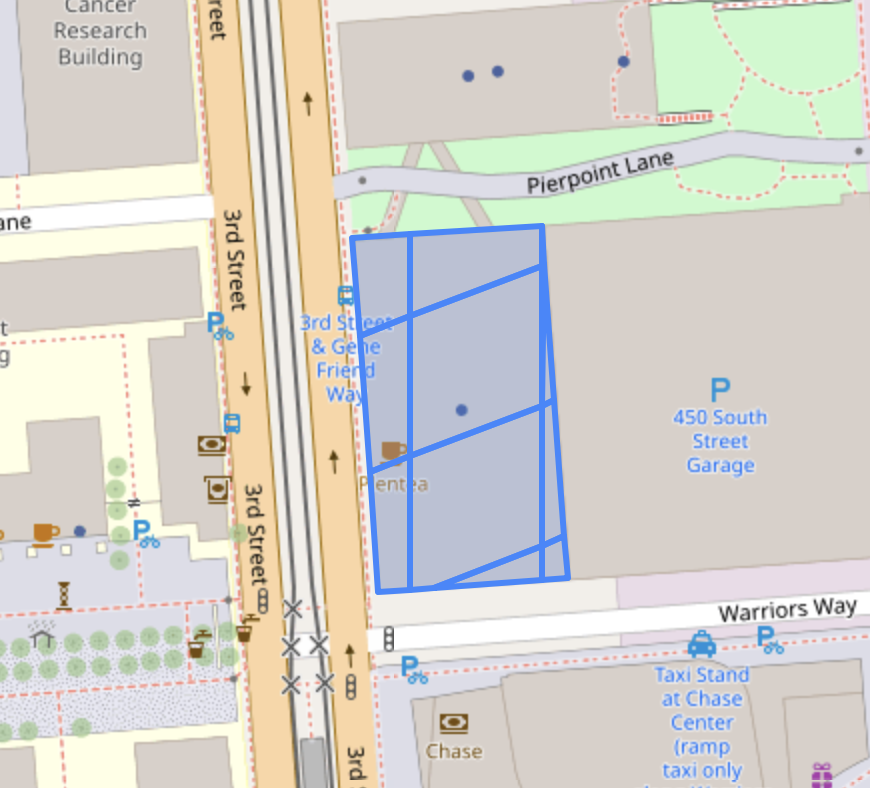

The `-f oneline` arg will merge the geometries resulting from the cut into a single line `GEOMETRYCOLLECTION`. Otherwise, each constituent polygon will be printed on a separate line.


## `h3` Commands

These commands work with [H3 cells](https://h3geo.org).

### `cut`

A geometry can be cut by an H3 grid at a given resolution. This is analogous to the [S2 cut command](#cut).

```bash
> geos h3 cut
```

`geos h3 cut -l 3` | `geos h3 cut -l 5`
:----------------:|:----------------:
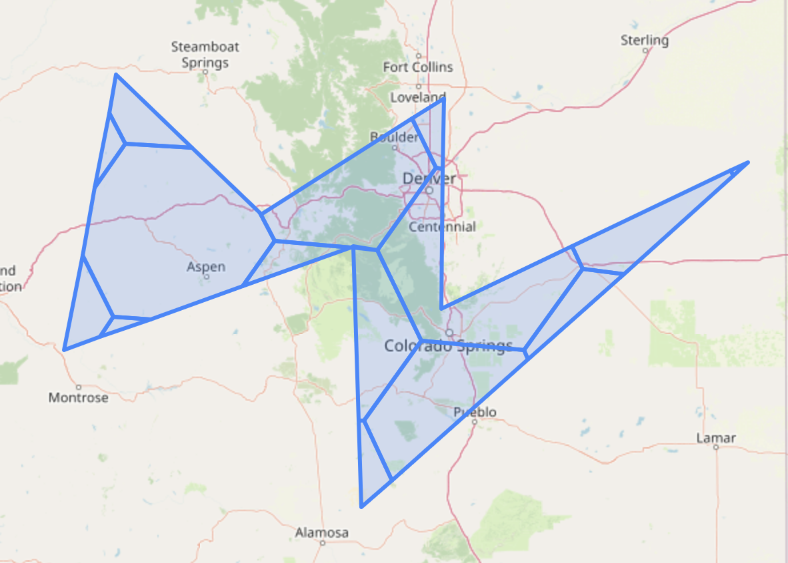 | 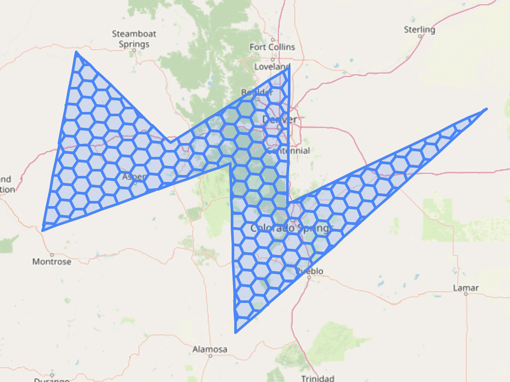


## `geom` commands

### `split`

You may want to partition a geometry into more regular sub-geometries than `geos s2 cut`.  This could be handy if you're trying to test / debug a spatial API query with evenly sized sub-queries.

```bash
> geos geom split -e 0.25 -f oneline -- "POLYGON ((-122.389181 37.769693, -122.388672 37.769718, -122.388602 37.768972, -122.389112 37.768942, -122.389181 37.769693))"
````


Original Geometry | Split Geometry
:----------------:|:----------------:
 | 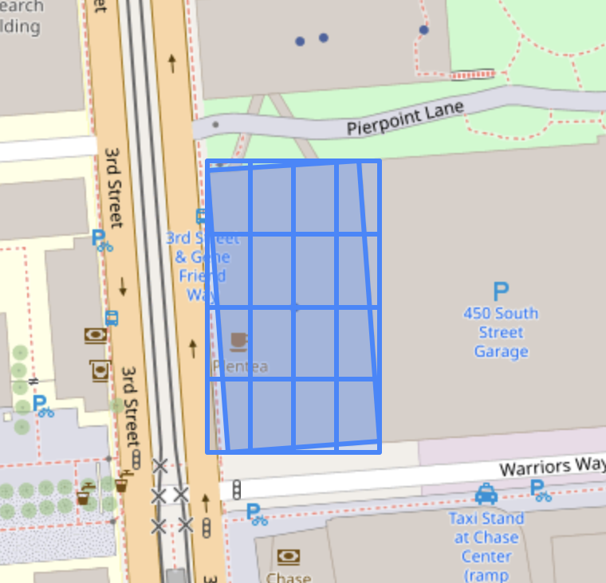

The `-e` or `--edge-proportion` arg dicatates the relative proportion that each partition will take up of the original geometry (more precisely, the original geometry's minimal bounding box). If you specify a proportion that does not evenly divide the edge (e.g. `0.33`), you'll obtain possibly unintuitive splits.


Uneven Split `-e 0.33` | Thresholded Split `-t 0.25`
:----------------:|:----------------:
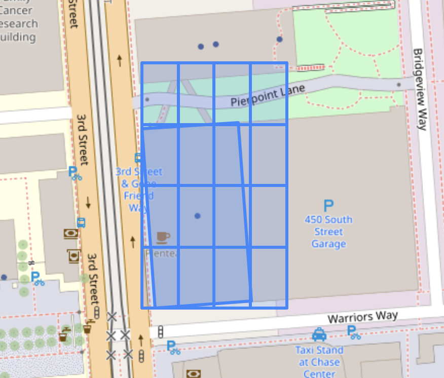 | 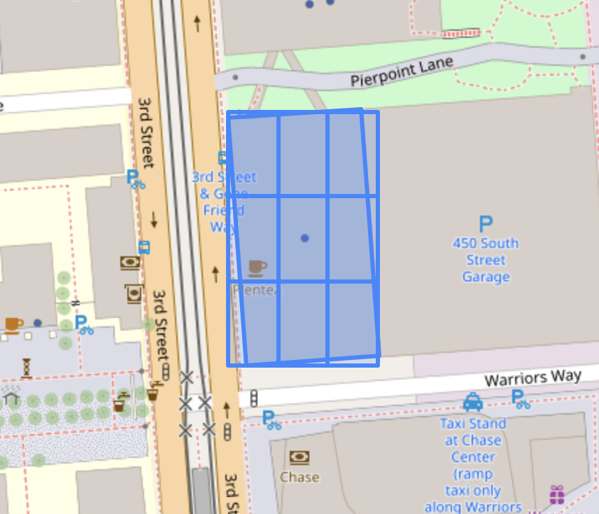


### `triangulate`

You can triangulate a geometry using the [ear clipping algorithm](https://en.wikipedia.org/wiki/Polygon_triangulation#Ear_clipping_method).

```bash
> geos geom triangulate -f oneline -- "POLYGON ((-122.389181 37.769693, -122.388672 37.769718, -122.388602 37.768972, -122.389112 37.768942, -122.389181 37.769693))"
```

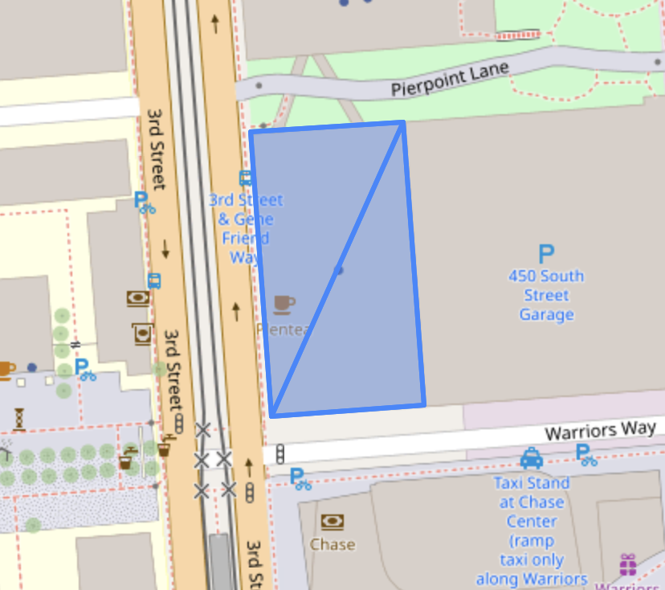


## `rand`

These commands involve random sampling. A typical use-case would be generating arbitrary inputs to test some spatial algorithm / API.

The `-s` or `--seed` argument to the `rand` command can be used to control the RNG for all subcommands.

### `point`

The simplest usage is to sample a point uniformly at random from anywhere on the Earth's surface

```bash
> geos rand -s 420 point
POINT(3.1614064126337524 -37.42948767053008)
```

You can generate more than one point
```bash
# Count the output lines.
> geos rand -s 420 point -n 69 | wc -l
      69
```

<br><br>
You can get fancier and restrict the sampling to a geometry. The sampling algorithm is relatively efficient since it is a direct sampler (i.e. no rejection sampling).

```bash
> geos rand -s 420 point -n 69 -f oneline -w "POLYGON ((-122.388994 37.769426, -122.38894 37.770028, -122.388591 37.768913, -122.388157 37.76915, -122.388951 37.768455, -122.388827 37.769349, -122.389771 37.768493, -122.389954 37.76965, -122.38961 37.768849, -122.389584 37.770062, -122.389278 37.769252, -122.389219 37.769684, -122.388994 37.769426))"
```

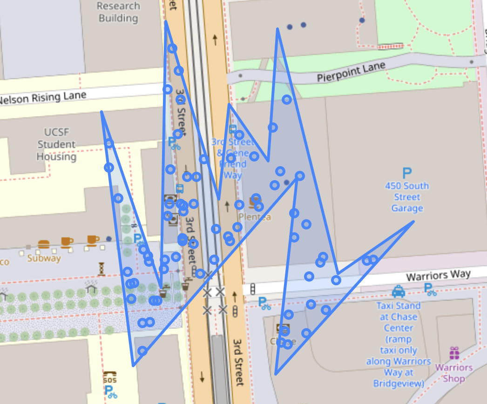

### `cell-to-poly`

In case you want to convert an S2 cell into a polygon representation:
```bash
> geos s2 cell-to-poly -- 9263763445025603584

POLYGON((-122.39009006966613 37.769200437923466,-122.39009006966613 37.76800891143169,-122.38867383494343 37.76844387567673,-122.38867383494343 37.76963540683453,-122.39009006966613 37.769200437923466))
```
